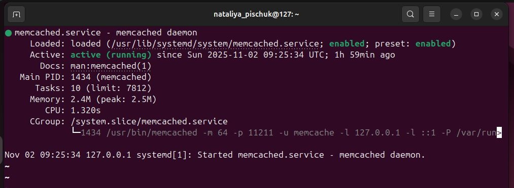
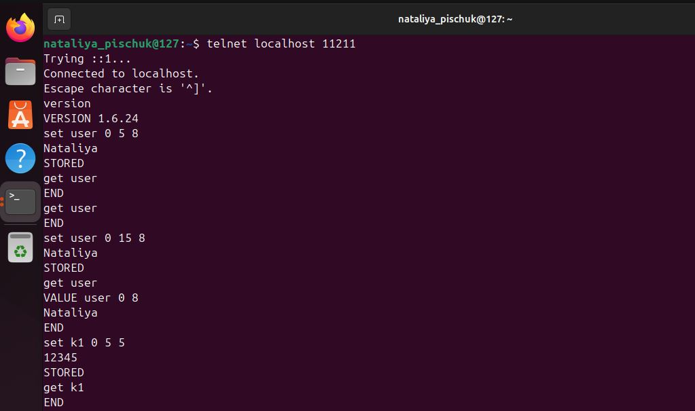
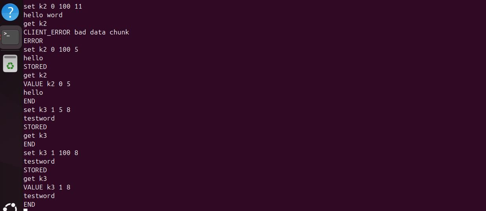
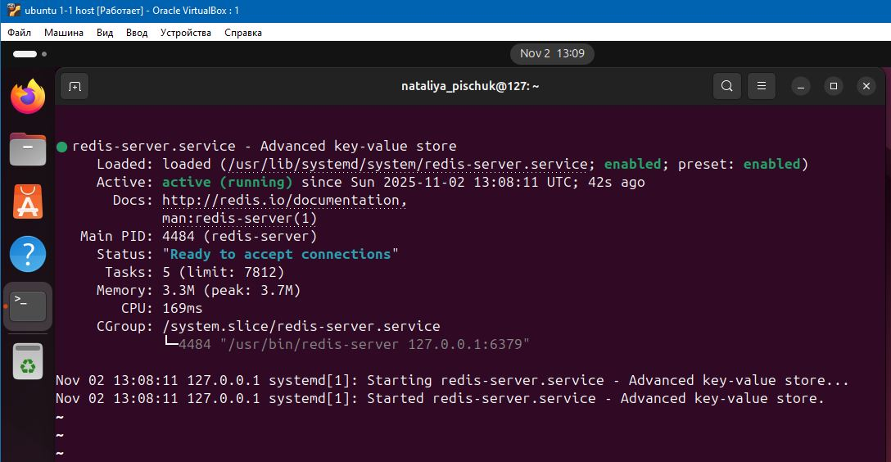
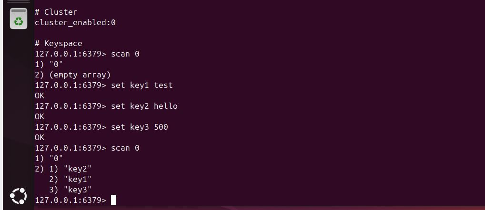

# Домашнее задание к занятию «Кеширование Redis/memcached» - Наталья Пищук
## Задание 1. Кеширование
Приведите примеры проблем, которые может решить кеширование.

## Ответ
Кэширование (хранение данных для быстрого доступа) может помочь решить различные проблемы, например:
- Ускорить загрузку страниц — часто запрашиваемые части страниц хранятся в памяти, что ускоряет отображение контента для посетителей.
- Уменьшить нагрузку на сервер — когда часть данных кэшируется, серверу не нужно генерировать их каждый раз при запросе страницы.
- Улучшить отказоустойчивость — если основной сервер недоступен, кэшированные данные могут быть отданы из хранилища веб-сервера, proxy-сервера или CDN.
- Экономить трафик — позволяет сократить объём передаваемых с сервера данных, так как часть контента берётся из кэша на стороне клиента или сети доставки контента.

  
## Задание 2. Memcached
Установите и запустите memcached.

Приведите скриншот systemctl status memcached, где будет видно, что memcached запущен.

## Решение
Скриншот о запуске 

## Задание 3. Удаление по TTL в Memcached
Запишите в memcached несколько ключей с любыми именами и значениями, для которых выставлен TTL 5.

Приведите скриншот, на котором видно, что спустя 5 секунд ключи удалились из базы.

## Листинг команд
Я использовала команды с 5 секундами и увеличивала время, для того чтобы показать какие данные хранятся в заданных переменных

## Задание 4. Запись данных в Redis
Запишите в Redis несколько ключей с любыми именами и значениями.

Через redis-cli достаньте все записанные ключи и значения из базы, приведите скриншот этой операции.

### Установка и проверка redis
sudo apt install -y redis
sudo systemctl status redis

### Скриншот выполнения команд

